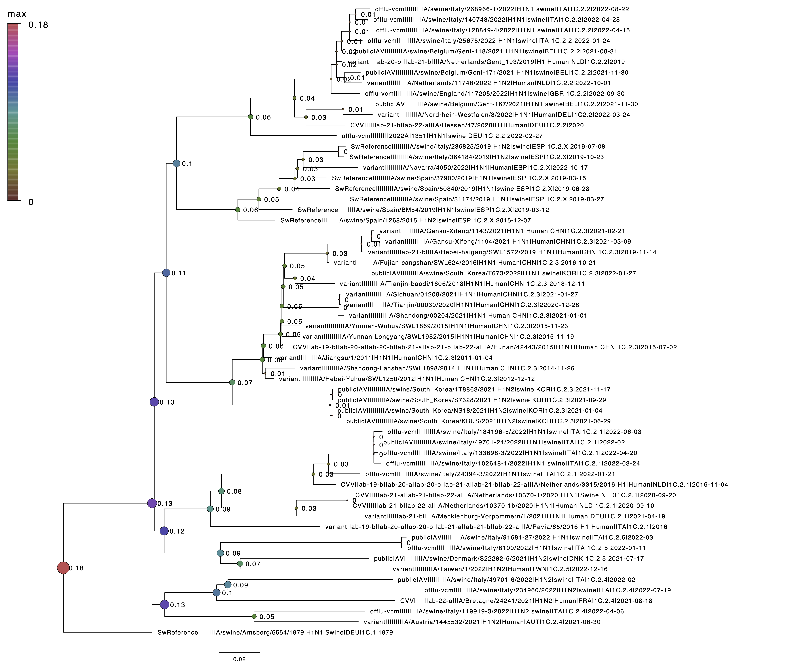

# Phylogenetic Diversity Statistics for All Clades in a Phylogeny
A project designed with algorithms to compute [Phylogenetic Diversity (PD) Statistics](https://en.wikipedia.org/wiki/Phylogenetic_diversity) - Minimum, Maximum, Average, Variance on a phylogenetic tree.

Grover, S., Markin, A., Anderson, T.K., and Eulenstein, O. (in press). Phylogenetic Diversity Statistics for All Clades in a Phylogeny. *Bioinformatics* XX:XX. (ISMB/ECCB 2023).

Abstract: The classic quantitative measure of phylogenetic diversity, PD, has been used to address problems in conservation biology, microbial ecology, and evolutionary biology. PD is the minimum total length of the branches in a phylogeny required to cover a specified set of taxa on the phylogeny. A general goal in the application of PD has been identifying a set of taxa of size k that maximize PD on a given phylogeny; this has been mirrored in active research to develop efficient algorithms for the problem. Other descriptive statistics, such as the minimum PD, average PD, and standard deviation of PD, can provide invaluable insight into the distribution of PD across a phylogeny (relative to a fixed value of k). However, there has been limited or no research on computing these statistics, especially when required for each clade in a phylogeny, enabling direct comparisons of PD between clades. We introduce efficient algorithms for computing PD and the associated descriptive statistics for a given phylogeny and each of its clades. In simulation studies, we demonstrate the ability of our algorithms to analyze large-scale phylogenies with applications in ecology and evolutionary biology.

# Requirements
  * Python 3.7
 
# Packages Used
  * dendropy
  * Bio
  * decimal
  * scipy
  * numpy
  * argparse
  
# Phylogenetic Diversity measures in the tool  
The statistic arguments are as follows:
- fmin: minimum PD
- fmax: maximum PD
- favg: average PD
- fvar: variance in PD
- fhot: hotspot(beta) measure
- fall: computes all the statistics above

# Tutorial
To run this tool on a nexus tree please follow the steps below:

1. place a nexus binary treefile in the same directory as the project
2. run pdstat.py with the following arguements: treename, (int)k, function (-fmin,-fmax, -favg, -fvar, -fhot, or -fall)

  * example :  
  `pdstat.py t100.tre 10 -fmax"`  
  The example above runs pdstat.py on the example treefile with 100 taxa and finds the maxPD for k=10 taxa in the tree.
  
  Note: the user can run multiple functions on the treefile, eg. `pdstat.py treename.tre 10 -fmax -fmin`, or can run all functions with the `-fall` flag.
    
3. The output of the above command will be a file named "annotated_tree_nex" with the clades annotated with the maxPD (or other statistic) at clades with k=10. This tree file can be opened with FigTree, and the nodes annotated using the "node labels" or "node shapes" menu.

Input test files with different numbers of input taxa are also present in the directory (t50.tre,t100.tre,t200.tre,t300.tre,t400.tre).

# Example
A rooted tree file for the influenza A virus, H1 hemagglutinin gene for the Eurasian avian lineage (1C) was extracted from the [OFFLU-WHO Vaccine Consultation Report for September 2022](https://www.offlu.org/). These data were used to quantify the maximum phylogenetic diversity across each node of the phylogeny (k=1). The PD measure quantifies clades across the tree that have relatively higher amounts of diversity. These data were collected within a 6 month temporal window, and clades that have relatively higher amounts of genetic diversity may be associated with antigenic drift away from pandemic preparedness candidate vaccine viruses (CVV) - see [Anderson et al. (2021)](https://perspectivesinmedicine.cshlp.org/content/11/3/a038737.full).

The subsequent image demonstrates that the newly emerged 1C.2.4 has the highest amount of observed diversity reflected by larger circles on the nodes which may reflect rapid diversification - specifically, there are long terminal branches relative to internal branches, and this may reflect exponential population growth of the virus (see [Volz et al. (2013)](https://journals.plos.org/ploscompbiol/article?id=10.1371/journal.pcbi.1002947)).

  

# Scalability of Algorithms
The above algorithms were run on different trees with the number of leaves ranging from 1000 to 10000 taxa with k = n

